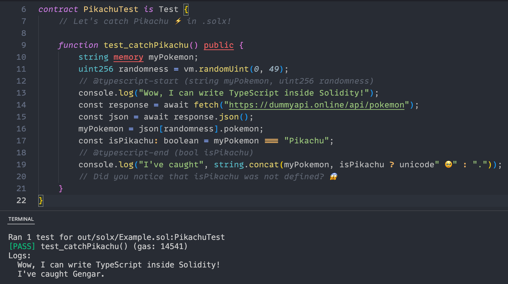

# SOLX

Write Solidity AND **any other programming language** <ins>at the same time</ins>!

</img>

## Usage

> [!IMPORTANT]
> Proof of concept. For research purposes only.

**Clone**

```shell
git clone https://github.com/ZeroEkkusu/solx
```

**Install**

```shell
soldeer install & bun install
```

**Hook**

```
source solx/hooks.sh
```

This will hook SOLX transpiler to Forge.

**Build**

```shell
forge build
```

**Test**

```shell
forge test
```

**Experiment**

> [!NOTE]
> Try it out: [`test/Example.solx`](./test/Example.solx)

 

Specify variables to **sync** between Solidity and TypeScript:

```solidity
uint256 a;
// @typescript-start (uint256 a)
a++;
// @typescript-end ()
assertEq(a, 1);
```

Specify variables to **clone** from TypeScript:

```solidity
uint256 a = 1;
// @typescript-start ()
const b = 1;
// @typescript-end (uint256 b)
assertEq(a, b);
```

Use `console.log` in TypeScript:

```solidity
// @typescript-start ()
console.log('👀');
// @typescript-end ()
```

Only TypeScript is supported currently.

## License
​
Licensed under either of

- Apache License, Version 2.0, ([LICENSE-APACHE](LICENSE-APACHE) or http://www.apache.org/licenses/LICENSE-2.0)
- MIT license ([LICENSE-MIT](LICENSE-MIT) or http://opensource.org/licenses/MIT)

at your option.

Unless you explicitly state otherwise, any contribution intentionally submitted for inclusion in the work by you, as defined in the Apache-2.0 license, shall be dual licensed as above, without any additional terms or conditions.

---

© 2024 Zero Ekkusu